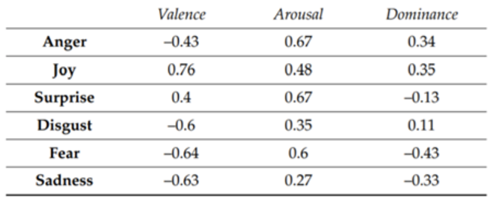

# Exploring Emotional Valence in Pixar Films

DSC160 Data Science and the Arts - Midterm Project Repository - Spring 2020

Project Team Members: 
- Amir Uqdah, auqdah@ucsd.edu
- Sabrina Ho, ssh026@ucsd.edu
- Xinrui Zhan, x5zhan@ucsd.edu
- Yiheng Ye, yiy291@ucsd.edu
- Byungheon Jeong, b1jeong@ucsd.edu

## Abstract

(10 points) 

  This project aims to compare the changes in emotion in Pixar movie scenes based on the frames of different pixar movies. We used  30 scenes 50 seconds apart from each other and 3 frames within each scene in the popular animated Pixar movies Big Hero 6, Incredibles 2, Toy Story 4, Cars 3, and Wall E.  We attempt to qualify the emotion content of each scene based on features of images such as warmth of colors, brightness, and  hue saturation value. We expect to see a correlation between the features used in the film and the emotions that are perceived or felt during the film. Also, we want to figure out the general trend of “how does a Pixar movie ‘feel’ over time”. After extracting features we need, we will build our own color-emotion map to label our data. Then we will use them to feed our classification models. Afterwards, we will make several analysis visualizations such as cluster plots or sound wave plots using online tools or python libraries. We plan to display our results in the form of visualizations such as t-SNE graphs or bitmaps.
  
  As animated filmmakers have full control over the visual medium, visual cues signaling the changing of emotion in animated films are always intentional. As such, this analysis can shed light on what visual features popular culture looks for different emotions.

## Data

(10 points) 

  Our data is collected from the website Animation Screencaps (link: https://animationscreencaps.com). This website contains over 500 movies including the series of Disney, Pixar, and so much more. As mentioned earlier, in this project we are using the following movies’ screencaps as our data: Big Hero 6, Incredibles 2, Toy Story 4, Cars 3, and Wall E. This Animation Screencaps website contains screencaps for each movie. We are scraping 30 scenes in total and 3 cap per scene, and they are all 50 seconds apart from each scene. The next section will talk in detail on how we scraped the screencaps.

## Code

(20 points)

- Data acquisition/scraping: **Scraping.ipynb**
  This notebook uses bs4 BeautifulSoup and requests libraries to scrape movies‘ screencaps from the Animation Screencaps website mentioned in the previous data section. You can see in the notebook that there is a scratch function that scrapes a total of 30 scenes and 3 caps per scene which are all 50 seconds apart from each scene. 
  
- Cleaning: **Main Notebook Preprocessing and Features Extraction.ipynb**
This notebook preprocesses the scenes we scraped using the first notebook and extracts features including PAD (Pleasure, Arousal, Dominance), blur, brightness, saturation, and optical flow. We iterate all caps we scraped and we resize them to (320, 768). We then use these feature functions to find the averages of all features within each scene and compile them into a dataframe, and save them as a csv file. 
- Analysis:
  - Features:
      - Brightness: We calculate the brightness for each image by calculating the mean of the third channel in image hsv format. The bigger the result, the more bright the image is. The brightness data will be used in calculating PAD (Pleasure, Arousal, Dominance). Below are the images with the biggest and smallest brightness in the movie toy story 4.
      
      
      
      - Saturation: We calculate the saturation for each image by calculating the mean of the second channel in image hsv format. The bigger the result, the more saturated the image is. The saturation data will be used in calculating PAD (Pleasure, Arousal, Dominance). Below are the images with the biggest and smallest saturation in the movie Big Hero 6.
      
      
      
      - Blur: While skimming through our dataset, we found out that some images are blur. Also, we thought that the degree of blur could be related to the emotion: A more blur scene could have a higher ability to contain certain emotion’s information such as surprise, excitement or fear. Based on https://www.pyimagesearch.com/2015/09/07/blur-detection-with-opencv/, we implement a method to calculate the degree of blur in a single image. The higher the number of degrees of blur, the less blur this image is. Below are the least blur and most blur images in movie Cars 3. 
      
      
      
      - PAD: Based on Machajdik and Hanbury’s paper (http://www.imageemotion.org/machajdik_hanbury_affective_image_classification.pdf), we calculate the degree of Pleasure, Arousal, and Dominance based on the three equations. We will use there three in our baseline model. 
      
      
      - Faces: Used face emotion recognition to suggest strength of the emotion estimated. Classified using six different emotions.
      - Optical flow: We used the norm of the optical flow vector to represent how much changes are inside of two images’ transition. Since we have three caps per scene, we calculate both 2 transitions and get the mean of the norms to represent how many changes are inside of a scene. 
  - Baseline model(equations from the paper): **Baseline Model's Evaluation and Results.ipynb**
Based on Oana et.al’s paper, we labeled all scenes with 6 different emotions calculating by equations below. Here, we use the pleasure to represent valence. The prediction are stored in the baseline_celana_df.csv

  - Logistic regression model trained on outside dataset: **model trained on outside data.ipynb**
      - We found an emotion labeled images dataset (http://www.imageemotion.org/testImages_artphoto.zip). We select images with label anger, joy, disgust, fear, and sadness and we use all features we extracted (except the optical flow, since we are training on static single images) to train a logistic regression model and labeling our screencaps for all scenes with corresponding emotions. The predictions are stored in logistic_regression_trained_on_outside.csv.
  - An unsupervised clustering: Model unsupervised and viz.ipynb
  - Facial recognition: ??

- Generating results:
  - Output prediction made by models: Baseline Model's Evaluation and Results.ipynb,  model trained on outside data.ipynb
  - Visualization of high-dimensional feature data and clusters:Model unsupervised and viz.ipynb
  - Visualization of supervised model predictions after dimension reduction:Viz of supervised, Dimension Reduction.ipynb
  - Visualization of features: More viz about feature.ipynb
  
- Testing: (the following notebooks are examples of each functions we used in the main preprocess and feature extraction notebook)
  - Brightness and Example.ipynb:
    - This notebook contains example of getting the mean image brightness with the library cv2
  - Degree of blur and Example.ipynb:
    - This notebook contains examples of calculating the blurriness of an image that uses the library cv2
  - Saturation and Example.ipynb:
    - This notebook contains examples of getting the mean saturation of an image with the library cv2
  - opticalFlow.ipynb:
    - This notebook calculates the optical flows between images using the library cv2. It returns an array in order to calculate the distances. 

## Results

(30 points) 

- Output visualization notebooks in pdf form: Model unsupervised and viz.pdf, Viz of supervised, Dimension Reduction.pdf. This two pdf visualize our models’ result (unsupervised and supervised) after dimension reduction of t-sne. The former one also contains some other visualization about features extracted. Later we added More viz about feature.pdf to visualize more details of our features.

- Csv tables record feature extraction and modeling output for supervised learning: clean_df.csv report features extracted from scenes while logistic_regression_trained_on_outside.csv and baseline_clean_df.csv record model predictions using those features
  - Important Images about Result plots:
    - Correlation between dominance and pleasure:
    
    - tSNE graphs for model prediction:
    
    

  - Unsupervised learning:
    - tSNE graph for dimension reduction when perplexity=5:
    
    - K-means for 6 clusters:
    
    - Emotion shift based on 3 most possible emotions generated by baseline model (Higher means happier):
    
    
    
    
    
    

- Important Tables about feature:

Also, in the result directory. We created two gifs. One is the flow of images that are labeled with joy in logistic regression model in the whole dataset and one is the opposition images flow we created based on joy images. 

## Discussion

(30 points, three to five paragraphs)

Our data shows that there are some identifiable patterns in “Pixar” film. That is, they generally start happy and after some struggles (intense emotional shifts), there is a return to happiness. There is potential for improvement regarding our log prediction, but this can easily be improved later.

The reason this finding is significant is because it suggests that the success of Pixar films' storytelling is largely formulaic and it can potentially allow us to group and analyze similar films based on their emotional shifts and story arcs. I think this sort of finding proves the importance of color and lighting when storytelling and would ultimately show that artists have a very powerful influence over the viewer and emotional reception of the film.

Regarding the original artist’s response, we think our results would be welcomed and useful. Emotions have long been considered as subjective concepts and major factors in film making. As a result, even though film makers are trying hard to create the atmosphere in scenes for certain emotions they wanna express, what audience actually feels from it could differ. To some degree, our analysis offers a way to quantify the audience’s subjective emotional feelings and could be a good feedback for filmmakers. Also, the general patterns could be drawn from doing similar analysis on a larger dataset, and the results could be used for filmmakers to produce more rendering movies. 

In a broader sense, this proves that subtle changes in color schemes can have large emotional shifts in the audience. This suggests that color choice in media is not necessarily arbitrary, but instead calculated and shared among viewers to produce certain emotional responses. This also proves that we, as the receiver of information of all kinds of mediums, do not own the control of ourselves’ feeling generation. Human beings’ emotions and feelings are easily manipulated and affected. See the below images. The second row of images only changed the brightness and saturation of the ones in the first row, but we can easily detect the different emotions feelings that two rows of images express.

In the future we hope to analyze music along with the image features to produce more holistic results as these films are a combination of image and sound. We also hope to make our findings more accessible by making web visualizations for the public to access. Moreover, we hope to create our own labeled data and to train on them using different neural networks to get the best result, and perhaps create our own model. We believe that with the large amount of data, we can get a good result if we get to expand on this project.

## Team Roles

- Amir Uqdah: Amir came up with the idea of this project. He did research on the topic then suggested it to the team. Amir also wrote the baseline model and extended the facial recognition model.
- Sabrina Ho: Sabrina combined pieces of the project together into the final report and edited the README on GitHub. She also did analysis on the movie Big Hero 6.
- Xinrui Zhan: Xinrui wrote the scarping function for team members to use in order to collect our data from the website. He also worked on the baseline model and the logistic regression model. Nonetheless, Xinrui organized our GitHub repository and categorized each file into its corresponding files. 
- Yiheng Ye: Yiheng worked on the unsupervised model and the visualization for the project included tSNE graphs. He is also involved in writing the report.
- Byungheon Jeong: Byungheon wrote the optical flow function that was used to analyze our data. He also contributed in writing the report.

## Technical Notes and Dependencies

The following are the libraries we used in this project. All code can be run on datahub/jupyter notebook. Some datapath may need adjustment and we suggest running the notebooks outside the code folder or you can directly look at the output PDFs.
- Packages used for Feature Extraction:
  - Opencv2
- Packages used for visualization:
  - Seaborn
  - Matplotlib 
  - Axes3D
- Packages used for modeling:
  - Scikit-learn
  - Scipy 

## Reference

- Papers
  - [1] https://arxiv.org/pdf/1712.02896.pdf 
  https://l.messenger.com/l.php?u=https%3A%2F%2Fcdn.fbsbx.com%2Fv%2Ft59.2708-21%2F91130122_150218316330669_7271658521534398464_n.pdf%2FEmotion_Classification_Based_on_Biophysical_Signal.pdf%3F_nc_cat%3D109%26_nc_sid%3D0cab14%26_nc_ohc%3DpdmcWz3ftsMAX-rFqnw%26_nc_ht%3Dcdn.fbsbx.com%26oh%3D79d131248ac81c681125e33979988560%26oe%3D5EBB8746%26dl%3D1&h=AT1bCJwYwLiM-VOt0k4_Eycj50YXn7T3cP50Q9mWGGpuEZVbxFpIbYOlLHZOXH1VkY9v-oQV3FkAxAIPB0ktwTHm55WeJXxYtkYndg3I3eMVHMhmu3cOzBk3SGM84_TgbEPlvm4RhjxgxbxofVWeYLh_rI0
  - [2] https://sosuperic.github.io/a-darn-good-yarn-website/ 
  - [3] https://arxiv.org/pdf/1712.02896.pdf 
  - [4] http://www.imageemotion.org/machajdik_hanbury_affective_image_classification.pdf
- Data
  - [1] https://animationscreencaps.com/
  - [2] http://www.imageemotion.org/testImages_artphoto.zip
- Repositories
- Blog posts
  - [1] https://sosuperic.github.io/a-darn-good-yarn-website/

